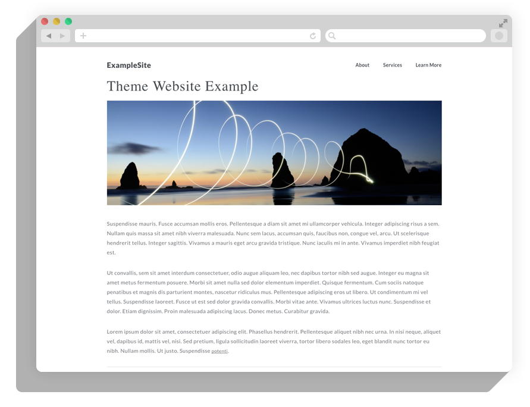
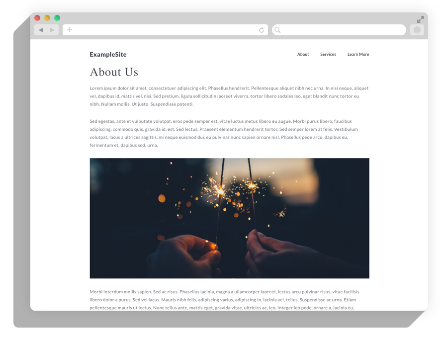

# prismic.io Example Theme

This is a simple nodejs website example theme for prismic.io.

It includes all the files, templates, and styles, and custom types needed to set up a simple website. You can use the prismic.io command line tool to automatically install this project, set up a prismic.io repository, and create the needed custom types.

The simple website includes a homepage with an image banner, content pages, and a simple navigation bar.


## Images





## Getting Started

It's easy to get up and running with this theme. Just follow these steps:

#### Install the prismic command line tool

Start by installing the command line tool globally on your computer. Run the following command from your terminal:

```
$ npm install -g prismic-cli
```

#### Install the theme

Point your terminal to the location where you want to install the project folder and run the following command. The command line tool will prompt you to pick a name for your prismic repository and the project folder.

```
$ prismic theme https://github.com/levimykel/example-website-theme
```

This will automatically install the project files, set up a new prismic-repository, and create the custom types.


#### Launch the project locally

Once the project is installed, launch a local instance of the project. Start by installing nodemon on your computer with the following command. You can skip this step if you have already installed nodemon.

```
$ npm install -g nodemon
```

Point your terminal to the project folder and run nodemon to start your local server.

```
$ nodemon app.js
```

You won't be able to see much until you actually add some content in your prismic.io repository. 

#### Read the help page and create content

With the server running locally, you can point your browser to http://localhost:3000/help to learn more about creating content.

The help page also explains how to add prismic.io's preview functionality to your project.


## Deploy your project live

An easy way to deploy your Node.js website is to use [Heroku](http://www.heroku.com). Just follow these few simple steps once you have successfully [signed up](https://id.heroku.com/signup/www-header) and [installed the Heroku toolbelt](https://toolbelt.heroku.com/).

Create a new Heroku application.

```
$ heroku create
```

Initialize a new Git repository.

```
$ git init
$ heroku git:remote -a your-heroku-app-name
```

Commit your code to the Git repository and deploy it to Heroku.

```
$ git add .
$ git commit -am "make it better"
$ git push heroku master
```

Ensure you have at least one node running.

```
$ heroku ps:scale web=1
```

You can now browse your application online.

```
$ heroku open
```

## Licence

This software is licensed under the Apache 2 license, quoted below.

Copyright 2016 Zengularity (http://www.zengularity.com).

Licensed under the Apache License, Version 2.0 (the "License"); you may not use this project except in compliance with the License. You may obtain a copy of the License at http://www.apache.org/licenses/LICENSE-2.0.

Unless required by applicable law or agreed to in writing, software distributed under the License is distributed on an "AS IS" BASIS, WITHOUT WARRANTIES OR CONDITIONS OF ANY KIND, either express or implied. See the License for the specific language governing permissions and limitations under the License.
